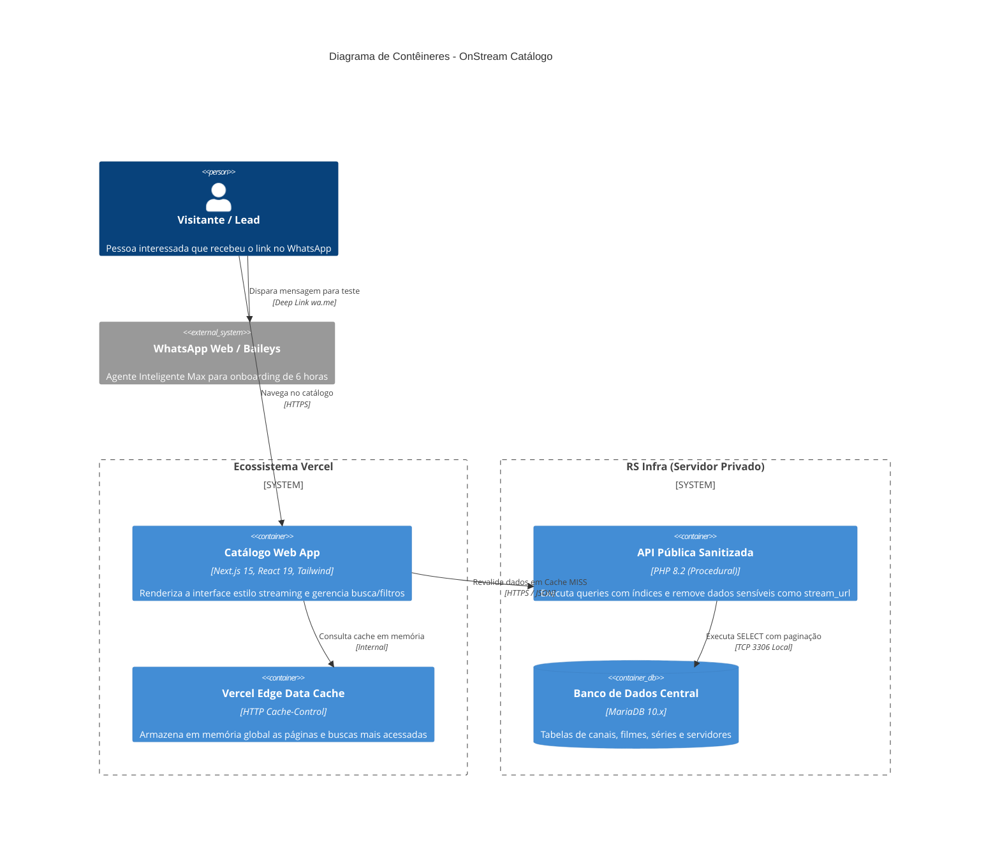

# 🏛️ 02. Arquitetura e Design de Sistema (SDD Architecture)

> **Documento de Arquitetura, Topologia e Estratégia de Cache** do OnStream Catálogo Web.

---

## 1. Topologia Geral & Princípio de Desacoplamento

A solução adota uma arquitetura em camadas desacopladas (*Headless Catalog Architecture*), onde o armazenamento e enriquecimento dos dados ocorrem na infraestrutura central (MariaDB na RS Infra) e a entrega pública aos usuários ocorre na infraestrutura de borda da Vercel.

```mermaid
graph TD
    subgraph "Usuários & Clientes"
        LeadMobile["📱 Lead no Celular (WhatsApp/4G)"]
        ClienteDesktop["💻 Visitante Desktop / Tablet"]
    end

    subgraph "Vercel Global Edge Network (Anycast CDN)"
        EdgeRoute["🌐 Edge Router & DNS (catalogo.onstream...)"]
        EdgeCache["⚡ Edge Cache Layer (SWR / ISR)"]
        NextApp["⚛️ Next.js 15 App Router (Server Components)"]
    end

    subgraph "RS Infra (Oracle BR / Contabo US)"
        Traefik["🛡️ Traefik Reverse Proxy (SSL Let's Encrypt)"]
        PublicAPI["🐘 api_catalogo_publico.php (Read-Only Sanitizado)"]
        MariaDB[("🗄️ MariaDB Central (catalogo_canais, filmes, series)")]
        CronSync["⏰ Cron Job Diário (api_atualizar_catalogo.php)"]
    end

    subgraph "Conversão & Atendimento"
        WhatsAppBot["🤖 Max Agente IA (WhatsApp / Baileys)"]
    end

    LeadMobile -->|Acessa Catálogo| EdgeRoute
    ClienteDesktop -->|Acessa Catálogo| EdgeRoute
    EdgeRoute --> EdgeCache
    EdgeCache -->|Cache HIT (~20ms)| LeadMobile
    EdgeCache -->|Cache MISS / Revalidate| NextApp
    NextApp -->|HTTPS GET com Cache-Control| Traefik
    Traefik --> PublicAPI
    PublicAPI -->|SELECT otimizado com LIMIT| MariaDB
    CronSync -->|Download M3U & Atualização| MariaDB

    LeadMobile -.->|Clique em 'Pedir Teste'| WhatsAppBot
```

---

## 2. Diagrama de Contêineres (C4 Model - Nível 2)



---

## 3. Estratégia de Cache de Borda (Edge Caching)

Para garantir **zero sobrecarga** no MariaDB e velocidade relâmpago para o usuário final, a aplicação utiliza a diretiva **Stale-While-Revalidate (SWR)** implementada no Next.js:

```http
Cache-Control: public, s-maxage=3600, stale-while-revalidate=86400
```

### Funcionamento do Ciclo de Vida:
1. **Primeiro Acesso (Cold Start):**
   - O Next.js consulta a API PHP do painel.
   - A resposta JSON é armazenada na memória da CDN Edge da Vercel.
   - Tempo de resposta: ~250ms.
2. **Acessos Subsequentes (dentro de 1 hora):**
   - Todos os visitantes que acessarem a mesma aba ou mesma busca recebem os dados diretamente da memória da Vercel mais próxima (ex: Edge São Paulo).
   - **Zero chamadas** ao servidor MariaDB.
   - Tempo de resposta: ~20ms.
3. **Após 1 hora (Revalidação em Segundo Plano):**
   - O visitante ainda recebe a resposta instantânea em cache (*stale*).
   - Em background, a Vercel dispara uma requisição silenciosa para o PHP atualizar os dados (*revalidate*).
   - O visitante nunca sofre lentidão.

---

## 4. Blindagem e Segurança de Dados

### 4.1. Regra de Ouro: Sem `stream_url`
O arquivo legado `api_get_catalogo.php` possuía uma concatenação que retornava `$select_cols .= ", stream_url";`.
- No novo endpoint dedicado [api_catalogo_publico.php](file:///home/rodrigo/onstream_painel_administrativo/api_catalogo_publico.php), a coluna `stream_url` é **terminantemente excluída** de todas as consultas SQL.
- A API retorna estritamente: `nome`, `logo_url`, `grupo`, `ano`, `total_episodios` e `criado_em`.

### 4.2. Tratamento de Imagens e Hotlinking
- Muitos provedores de logo de canais ou pôsteres de filmes bloqueiam hotlinking ou utilizam URLs HTTP sem SSL.
- No Next.js, utilizaremos o componente `<Image />` com `next/image` configurado para **Image Optimization** e proxy automático, garantindo que todas as imagens sejam servidas em formato WebP/AVIF seguro via HTTPS.
